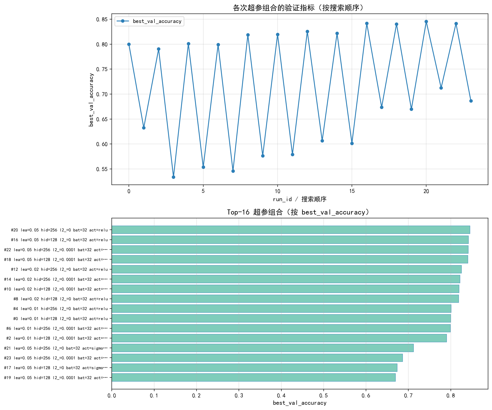
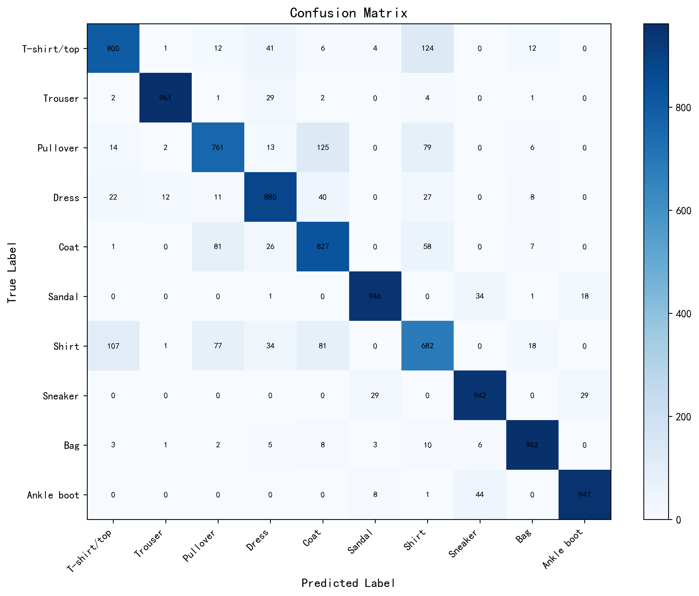
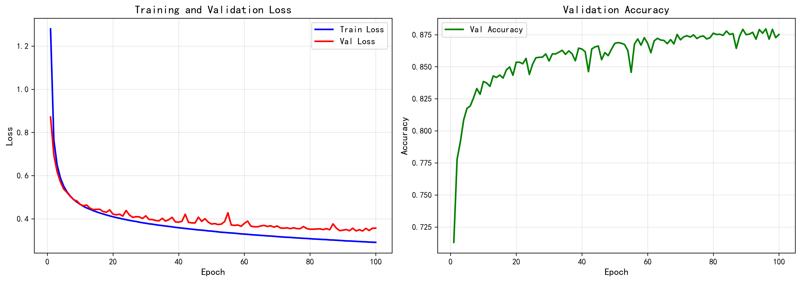
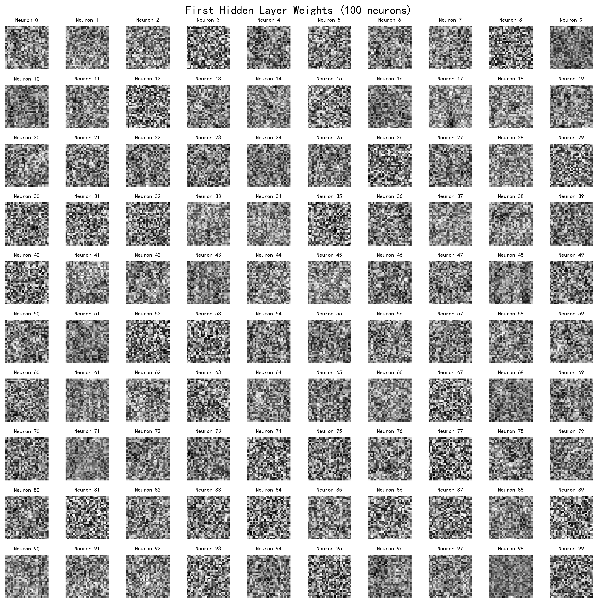
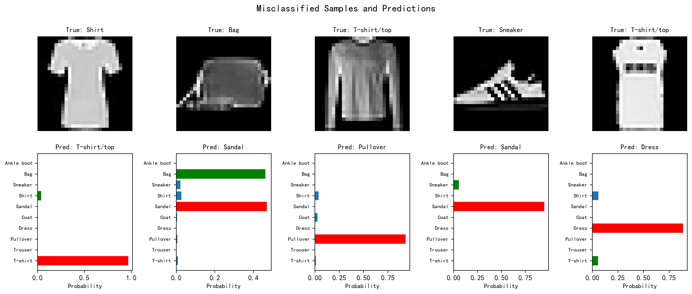

# Fashion-MNIST 三层 MLP 实验报告
**GitHub Repo**：https://github.com/pigggzzz/CV_HW1
**Google Drive**：https://drive.google.com/file/d/1nLbBagkfCif2p8NrAeCnNiPGtXiVam-R/view?usp=sharing
## 1. 实验概述
手工实现三层 MLP（无 PyTorch/TensorFlow 等自动微分框架），在 Fashion-MNIST 上完成 10 类分类。反向传播在 `src` 中自行实现。

## 2. 模型结构
- 输入: 784 (28×28 展平) → 隐藏 256（激活 RELU）→ 隐藏 256（同上）→ 输出 10（Softmax/交叉熵在损失中处理）。

## 3. 训练与优化
- **优化器**: SGD
- **损失**: 交叉熵 + L2（λ=0.0）
- **学习率与衰减**: 初始 0.05；Step: 每 10 个 epoch 将学习率乘以 0.95（以 total_epochs=100 计）
- **其他**: batch_size=32，计划最多 100 epoch，早停耐心 20；**实际完成** 100 epoch
- 依据**验证集准确率**保存 `checkpoints/best_model.npz`。

## 4. 超参数搜索
采用网格搜索: 
```
{'learning_rate': [0.01, 0.02, 0.05], 
'hidden_dim': [128, 256],
 'l2_lambda': [0.0, 0.0001], 
'batch_size': [32], 
'activation': ['relu', 'sigmoid']}
```
一共3 * 2 * 2 * 1 * 2=24 组超参，
短训每组合 20 epoch；详细指标见 `results/hparam_sweep_short.json` 与 `.csv`，汇总图 `figures/hyperparameter_search_summary.png`。

**短训后选取的最优超参**（将用于 100 epoch 长训）: {'learning_rate': 0.05, 'hidden_dim': 256, 'l2_lambda': 0.0, 'batch_size': 32, 'activation': 'relu'}（短训验证准确率 0.8455）。

## 5. 结果
- **最优验证准确率（本次长训过程）**: 0.8795
- **测试集准确率**: 0.8708
- **本阶段记录到的 epoch 数**: 100

### 混淆矩阵
从混淆矩阵可以看出，模型整体分类效果较好，测试集准确率约为 87%。其中 Trouser、Bag、Sneaker、Ankle boot 和 Sandal 等类别识别准确率较高，说明模型能够较好学习这些具有明显轮廓结构的服装特征。相比之下，Shirt、Pullover 和 Coat 等上衣类服装之间存在明显混淆，尤其是 Shirt 被误分类为 T-shirt/top、Pullover 和 Coat 的情况较多。这表明在 28×28 灰度低分辨率图像下，模型较难捕捉袖长、领口和衣身细节等细粒度特征。


## 6. 训练曲线
见 `figures/training_curves.png`（训练/验证 Loss 与验证 Accuracy）。
从训练曲线可以看出，模型训练过程收敛良好。前 10 个 epoch 内训练损失和验证损失快速下降，验证准确率由约 71% 快速提升至 83%以上，说明模型迅速学习到了服装图像的主要轮廓特征。20 个 epoch 后，损失下降速度明显减缓，验证准确率进入平台期并稳定在 87%–88% 左右。与此同时，训练损失持续下降而验证损失趋于平稳，表明模型存在轻微过拟合趋势，但整体泛化性能较为稳定。


## 7. 第一层权重可视化
见 `figures/first_layer_weights.png`，可将权重按 28×28 展布观察边缘与纹理等模式。
第一层隐藏层权重表现为对边缘、方向和局部轮廓的响应模式，例如水平、垂直及对角方向的亮暗变化，类似图像中的边缘检测器。

## 8. 错例分析
见 `figures/misclassified_samples.png`（前5张） 。
挑选了5个错例，发现模型主要在外观相近的服装类别之间产生混淆。例如，部分 Shirt 被误分类为 T-shirt/top，其主要原因在于二者均属于上衣类服装，在 28×28 灰度图像里外观比较相似；Bag被predict为Sandal，这是因为这个包的外观比较奇特，看上去像凉鞋，所以模型误判为Sandal。


